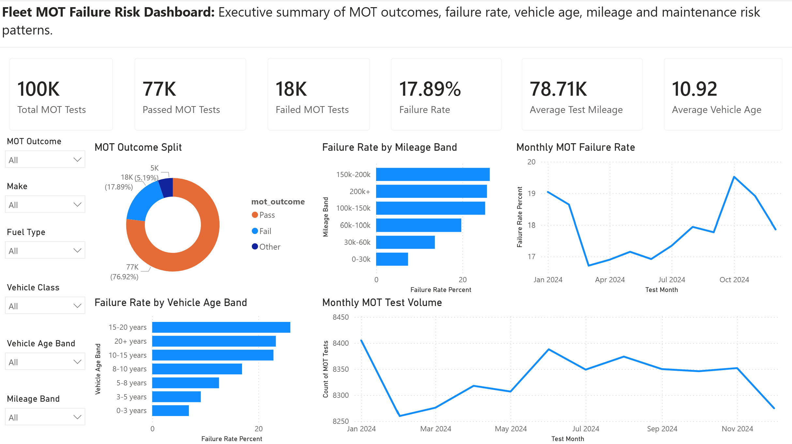
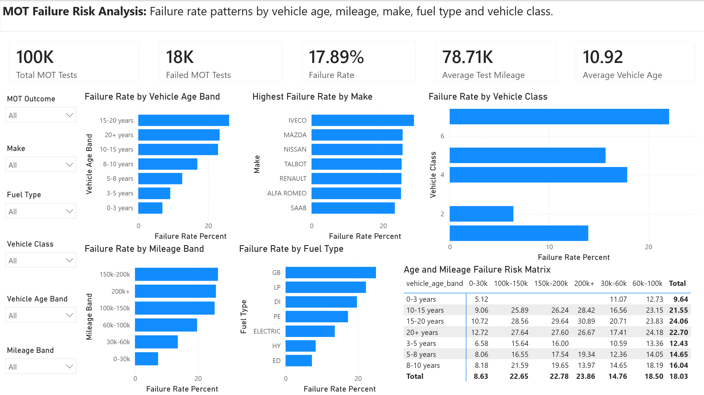
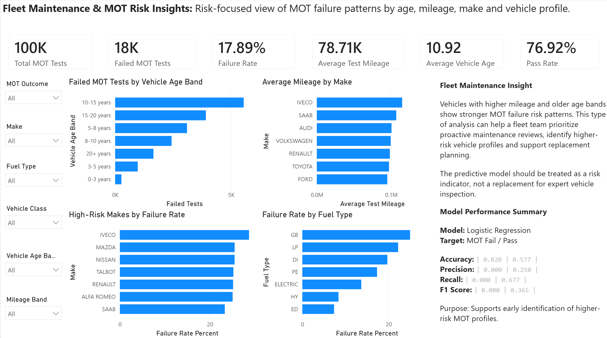

# Fleet MOT Failure Risk Model

## Dashboard Preview

The Power BI dashboard contains three report pages:

1. Executive Summary
2. Failure Risk Analysis
3. Fleet Risk Insights

### Executive Summary

This page provides a high-level overview of MOT outcomes, failure rate, pass rate, average mileage, average vehicle age and monthly MOT trends.



---

### Failure Risk Analysis

This page focuses on MOT failure risk patterns by vehicle age band, mileage band, make, fuel type and vehicle class.



---

### Fleet Risk Insights

This page connects MOT analysis to fleet maintenance decision-making, highlighting high-risk profiles, maintenance prioritisation and predictive model insight.

## 

## Project Overview

This is an end-to-end data analysis and machine learning portfolio project focused on UK MOT failure risk, fleet maintenance planning and vehicle reliability insight.

The project uses official anonymised DVSA MOT testing data for 2024 and follows a full analytics lifecycle: data sourcing, sampling, data understanding, data cleaning, feature engineering, exploratory analysis, SQLite database creation, SQL analysis, Power BI dashboard development and predictive modelling.

The project was designed to reflect a realistic fleet, transport or operations scenario where a business wants to understand which vehicle profiles are more likely to fail MOT tests and how this insight can support proactive maintenance planning.

---

## Business Problem

Fleet operators need to manage vehicle reliability, compliance, maintenance cost and operational availability.

MOT failure can create disruption, additional repair cost, vehicle downtime and compliance risk.

The main business question for this project is:

> Can MOT history data be used to understand and predict vehicle failure risk based on vehicle age, mileage, make, fuel type and vehicle class?

This project explores that question by analysing MOT outcomes, failure rates, mileage patterns, vehicle age patterns and a basic failure risk model.

---

## What I Built

This project includes:

- A structured GitHub repository
- Raw data source documentation
- Python script to create a manageable MOT sample dataset
- Data understanding notebook
- Data cleaning and preparation notebook
- Exploratory data analysis notebook
- MOT failure risk modelling notebook
- Cleaned local analysis dataset
- SQLite database creation script
- SQL data quality checks
- SQL analysis queries
- SQL views for Power BI reporting
- Power BI dashboard file
- Dashboard screenshots
- Model performance summary report

---

## Tools Used

- Python
- pandas
- NumPy
- scikit-learn
- matplotlib
- SQL
- SQLite
- Power BI
- Git and GitHub
- VS Code
- Jupyter Notebook

---

## Project Pipeline

Raw DVSA MOT CSV files → MOT sample dataset → Data understanding → Data cleaning → Feature engineering → EDA summary tables → SQLite database → SQL views → Power BI dashboard → Logistic regression failure risk model

---

## Skills Demonstrated

| Skill Area           | Evidence in This Project                                                   |
| -------------------- | -------------------------------------------------------------------------- |
| Data sourcing        | Used official DVSA MOT open data                                           |
| Data sampling        | Created a manageable MOT sample from large monthly CSV files               |
| Data understanding   | Reviewed rows, columns, missing values, data types and key MOT fields      |
| Data cleaning        | Standardised column names, cleaned text fields and converted dates/mileage |
| Feature engineering  | Created MOT outcome flags, vehicle age, mileage bands and age bands        |
| SQL                  | Created data quality checks, analysis queries and Power BI reporting views |
| Database development | Built a local SQLite database from cleaned MOT data                        |
| Power BI             | Built a three-page MOT failure risk dashboard                              |
| Machine learning     | Built a logistic regression MOT failure classification model               |
| Business analysis    | Converted MOT patterns into fleet maintenance and risk insight             |
| GitHub documentation | Published a structured portfolio project with screenshots and reports      |

---

## Dashboard Pages

| Page                  | Purpose                                                                            |
| --------------------- | ---------------------------------------------------------------------------------- |
| Executive Summary     | High-level MOT outcomes, failure rate, mileage, vehicle age and monthly trends     |
| Failure Risk Analysis | Failure rate patterns by age band, mileage band, make, fuel type and vehicle class |
| Fleet Risk Insights   | Maintenance prioritisation, high-risk vehicle profiles and model insight           |

---

## Machine Learning Model

A logistic regression classification model was built to predict whether a vehicle is likely to fail its MOT.

### Target Variable

- `1` = MOT Fail
- `0` = MOT Pass

### Model Features

The model uses practical vehicle and test-related features including:

- Test mileage
- Vehicle age
- Make
- Fuel type
- Vehicle class
- Mileage band
- Vehicle age band

### Model Purpose

The model is intended to act as a **risk indicator** to support proactive fleet maintenance planning.

It should not replace expert vehicle inspection or formal maintenance decisions.

---

## Key Outputs

This project includes the following completed outputs:

- MOT data source documentation
- MOT sample creation script
- Data understanding notebook
- Data cleaning notebook
- Exploratory data analysis notebook
- MOT failure risk model notebook
- SQLite database creation script
- SQL data quality checks
- SQL analysis queries
- SQL views for Power BI
- Power BI dashboard file
- Dashboard screenshots
- Model performance summary report

---

## How to Run This Project

To run this project locally:

1. Clone the repository.
2. Create and activate a Python virtual environment.
3. Install the required packages from `requirements.txt`.
4. Download the official DVSA anonymised MOT testing data results for 2024.
5. Place the extracted monthly CSV files inside `data/raw/`.
6. Run the MOT sample creation script:

```powershell
python src/create_mot_sample.py
```

7. Run the notebooks in order:

```text
01_data_understanding.ipynb
02_data_cleaning.ipynb
03_exploratory_data_analysis.ipynb
04_mot_failure_risk_model.ipynb
```

8. Create the SQLite database:

```powershell
python src/create_sqlite_database.py
```

9. Create SQL views:

```powershell
python src/run_sql_views.py
```

10. Export Power BI views:

```powershell
python src/export_powerbi_views.py
```

11. Open the Power BI dashboard:

```text
powerbi/dashboard.pbix
```

---

## Data Source

This project uses official anonymised MOT testing data published by the Driver and Vehicle Standards Agency (DVSA) via data.gov.uk.

For this project, the 2024 MOT testing data results were downloaded and used locally.

The raw data files are not uploaded to this GitHub repository because the monthly MOT CSV files and ZIP file are large external data files.

Users should download the official DVSA MOT testing data results for 2024 and place the extracted monthly CSV files inside `data/raw/`.

The data source is documented in:

`data/README_data_source.md`

---

## Limitations

This project has the following limitations:

- The analysis is based on a sample of 2024 MOT result data.
- Raw MOT files are large and are not uploaded to GitHub.
- Processed CSV files and the SQLite database are generated locally and are not uploaded to GitHub.
- The model does not include detailed MOT defect item descriptions yet.
- The model does not include service history, repair history, maintenance cost or driver behaviour.
- The machine learning model should be treated as a risk indicator, not a replacement for expert vehicle inspection or formal maintenance decisions.
- Findings are limited to the downloaded 2024 MOT result files, selected fields and project cleaning decisions.

---

## Current Project Status

**Current stage:** Power BI dashboard, SQL analysis layer, business reports and MOT failure risk model completed.

**Next stage:** Final GitHub review, career package, CV project entry, LinkedIn project description and interview preparation.

## Reports

The project includes the following written reports:

| Report                                                            | Purpose                                                                                    |
| ----------------------------------------------------------------- | ------------------------------------------------------------------------------------------ |
| [Executive Summary](reports/executive_summary.md)                 | Summarises the project purpose, business context, dashboard pages, model and key value     |
| [Methodology](reports/methodology.md)                             | Explains the end-to-end approach, from data sourcing through to modelling and dashboarding |
| [Business Recommendations](reports/business_recommendations.md)   | Converts analysis findings into practical fleet maintenance recommendations                |
| [Model Performance Summary](reports/model_performance_summary.md) | Summarises the logistic regression model, metrics, business interpretation and limitations |
